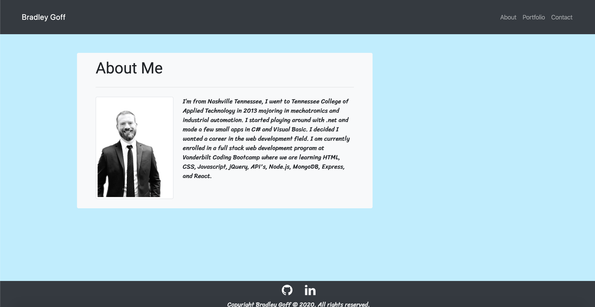
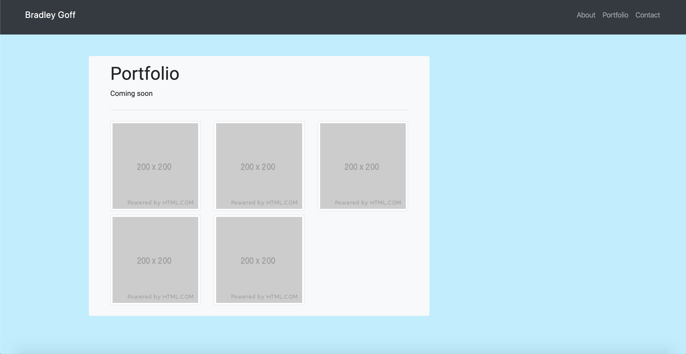

# Vanderbilt Coding Bootcamp homework assignment #2

## Notes

- My portfolio site.
- The site has an about me, portfolio, and contact page.
- The Site is controlled with bootstrap.
- The footer icons were made with font awesome.
- The fonts are from google fonts.

# Screenshots

# Website link

(https://bg9892.github.io/bootcamp-h2/)

